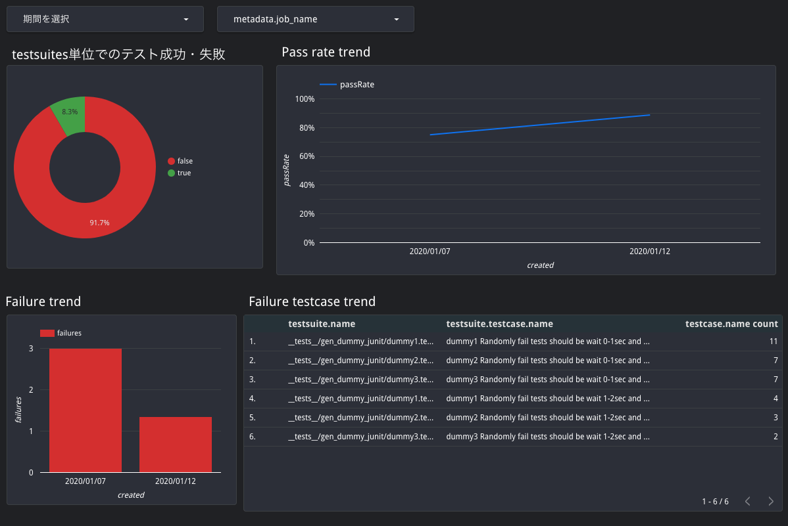
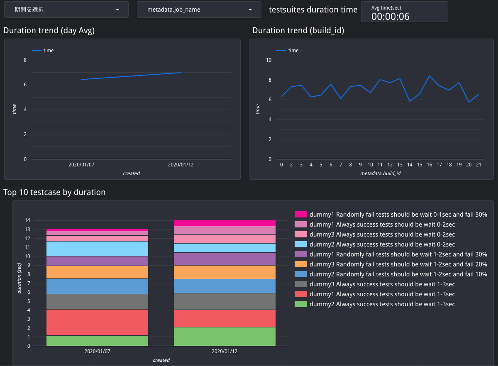

# gcf_junit_xml_to_bq
JUnit形式のテストレポートをBigQueryに蓄積するためのGCS + GCF + BigQueryコンポーネントの一式

最終的にはBigQueryのデータをDataStudioのようなツールで可視化し、CircleCIのinsightやAzure DevOpsのようにテストレポートのデータを可視化する基盤を自前で構築することがゴールです。

## DataStudioで可視化したサンプル





# Deploy
## Setup
```bash
export PROJECT_ID="YOUR_GCP_PROJECT_ID"
export BUCKET_PREFIX="PROJECT_SHORT_ID"

gcloud init # Select your GCP project
npm install
```

## terraform
GCFをトリガーするためのGCSのバケット、BigQueryのdatasetとtableをterraformで構築します

```bash
cd terraform
terraform init
terraform plan -var "project_id=${PROJECT_ID}" -var "bucket_prefix=${BUCKET_PREFIX}"
terraform apply -var "project_id=${PROJECT_ID}" -var "bucket_prefix=${BUCKET_PREFIX}"
```

### tfstateについて
デフォルトではtfstateはローカルに保存されます。  
GCSのようなクラウドのbackendに保存したい場合などは、そのためのterraformのコードを追加してください。

## Cloud Functions
GCSトリガーで起動するGCFを `gcloud` コマンドからデプロイします。

```bash
export GCS_BUCKET="${BUCKET_PREFIX}-pipeline-metrics-bq"
export BACKUP_BUCKET="backup-${GCS_BUCKET}"
npm run deploy
```

# Usage
```bash
# 任意のテストフレームワークでテストを実行し、JUnit形式のXMLのテストレポートを生成しておく

# GCSにアップロード
gsutil -h x-goog-meta-build_id:0 -h x-goog-meta-job_name:gcf_junit_xml_to_bq cp ${JUNIT_XML_PATH} gs://${GCS_BUCKET}/junit/
```

`-h x-goog-meta-***` はメタデータの付与です。詳しくは後述。


# コンセプト
過去のテスト結果にまたがってテストレポートを可視化するための基盤を、可能な限り「疎結合」かつ「低コストな運用」で実現します。

## フロー
- テストの結果をJUnit形式のXMLで保存する
- XMLをGCSの特定のバケットにアップロードする
- アップロードされたトリガーで起動するGCFにより、XML -> JSONに変換
- そのままGCFからJSONをBigQueryにload
- 好みのツール（DataStudioやGrafana）でBigQueryのデータをグラフ化

## 疎結合
プログラミング言語、テストフレームワーク、CIツール、導入する環境に可能な限り依存させていません。

JUnit形式のXMLはテスト界におけるテストレポートのデファクトスタンダードであり、言語を問わずメジャーなテストフレームワークであればこの形式の出力をサポートしています。あるいは、独自形式であっても別のツールでJUnitの形式に変換できる可能性が高いです。

BigQueryに取り込むフローは、GCSにXMLをアップロードするだけです。それぞれの環境で新しい言語やツールのセットアップは不要です。ただし、GCSにアップロードするために、 `gsutil` 、つまり `gcloud` のセットアップは最低限必要です。

データを可視化するための各ツールは、接続先としてBigQueryを基本的にサポートしています。好みのツールを使用してグラフなどの作成を行うことが可能です。

## 低コストな運用
XML -> JSONの変換と、BigQueryへのloadはGCF上で行われます。よって、そのためのインフラを自前で管理する必要はありません。

データ格納先としてBigQueryを選択しているため、RDBMSのようなDBを自前で管理する必要はありません。さらに、長期運用によりデータ量が増えたとしても、一般的にはBigQueryで軽々と扱えるデータ量に収まるはずです。

# 注意点など
## JUnitのXMLで定義されているスキーマ以外に任意の情報を付加したい
Usageに記載したGCSアップ時のメタデータによって実現可能です。GCFでXML -> JSONへの変換時に、メタデータを読み取り、BigQueryのスキーマ `metadata` の下の階層に自動的に追加されます。

例: `gsutil -h x-goog-meta-build_id:0 -h x-goog-meta-job_name:gcf_junit_xml_to_bq` とメタデータを付与してアップロードした場合、

- metadata.build_id: 0
- metadata.job_name: "gcf_junit_xml_to_bq"

の情報が自動的にBigQueryのレコードに追加されます。**CIジョブのビルド番号**、**ジョブの名前**、**ブランチ名**などの分析に必要な情報はこのメタデータの仕組みを利用してBigQueryのレコードに付与する想定です。

## BigQueryのスキーマ
上記のメタデータの挙動を実現するため、BigQueryのスキーマはデータをloadするタイミングで自動判定 & 自動追加されます。そのため、全てのカラムはNULLABLEとなっています。

基本的にはJUnitのXMLを素直にJSONに変換したスキーマとなりますが、 `allSuccess`, `created`, `metadeta` を独自に追加しています。

特に、 `created` はBigQueryでTableのパーティション設定に使われ、走査するデータ量を抑制してクエリの料金を抑えるために重要な働きをします。GCFの中でXML内の情報から自動付与され、仮に取得できなかった場合もフォールバックとして現在時刻を入れるようにしてあります。

## BigQueryのView運用
Tableに対して直接クエリするよりも、Viewを作成して使うことを推奨します。Viewを挟んでおくことで、ちょっとしたデータ整形などをSQLでアドホックに行うことが可能になります。

ただし、Tableのスキーマが更新された場合、Viewを作り直さないとViewのスキーマは更新されません。ツールによっては、Viewのスキーマが更新されないとカラムを正しく取得できないことがあります（DataStudioがこのパターン）。

方法は色々あるはずですが、手動対応で問題がなければBigQueryのUI上で一度Viewを削除して再度作り直すのが早いです。

## BigQueryの `job` テーブルについて
TODO機能の予約です。

テストレポートに加えて、CIジョブの各ステップの時間などを同様の仕組みで蓄積、可視化することを想定しています。(Azure DevOpsにおけるDuration Reportを再現したい）そのために名前を予約してあります。

# ライセンス
MIT
