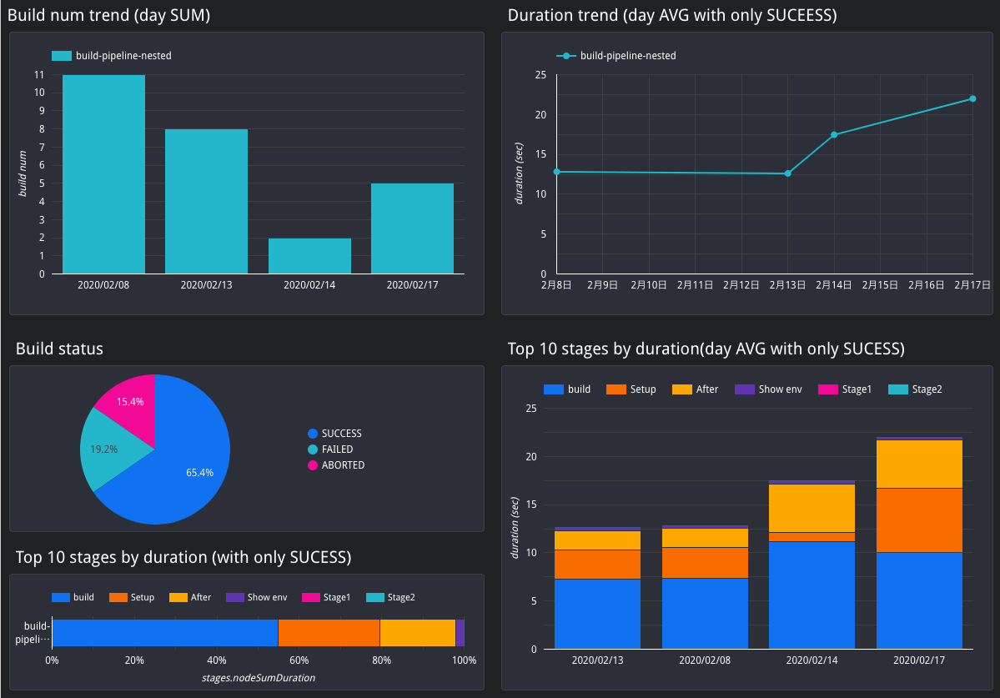

# Self building CI metrics dashboard with BigQuery
CIでのテストレポート、ビルド時間などのメトリクスデータをBigQueryに蓄積するためのGCS + GCF(Cloud Functions) + BigQueryコンポーネントの一式

このリポジトリは、以下の機能を持つスクリプトの組み合わせです

- JUnit形式のXMLをJSONに変換してBigQueryにloadするCloud Functions（GCSトリガー）
- JenkinsのPipelineジョブのビルド情報のJSONを整形してBigQueryにloadするCloud Functions（GCSトリガー）
- 必要なGCS, BigQueryを定義しているterraform

最終的にはBigQueryのデータをDataStudioのようなツールで可視化し、CircleCIのinsightやAzure DevOpsのようにテストレポートのデータを可視化する基盤を自前で構築することがゴールです。

## DataStudioで可視化したサンプル




# Deploy
## Setup
```bash
export PROJECT_ID="YOUR_GCP_PROJECT_ID"
export BUCKET_PREFIX="PROJECT_SHORT_ID"

gcloud init # Select your GCP project
npm install
```

## terraform
GCFをトリガーするためのGCSのバケット + BigQueryのdatasetとtable をterraformで構築します

```bash
cd terraform
terraform init
terraform plan -var "project_id=${PROJECT_ID}" -var "bucket_prefix=${BUCKET_PREFIX}"
terraform apply -var "project_id=${PROJECT_ID}" -var "bucket_prefix=${BUCKET_PREFIX}"
```

### tfstateについて
**デフォルトではtfstateはローカルに保存されます。**  
GCSのようなクラウドのbackendに保存したい場合などは、そのためのterraformのコードを追加してください。

## Cloud Functions
GCSトリガーで起動するGCFを `gcloud` コマンドからデプロイします。

```bash
export GCS_BUCKET="${BUCKET_PREFIX}-pipeline-metrics-bq"
export BACKUP_BUCKET="backup-${GCS_BUCKET}"
npm run deploy
```

# junit
テストレポートの形式としてデファクトであるJUnit形式のXMLを利用してデータをBigQueryに蓄積します。

過去のテスト結果にまたがってテストレポートを可視化するための基盤を、可能な限り「疎結合」かつ「低コストな運用」で特定のCIサービスに依存せずに実現します。

## Usage
```bash
# 任意のテストフレームワークでテストを実行し、JUnit形式のXMLのテストレポートを生成しておく

# GCSにアップロード
gsutil -h x-goog-meta-build_id:0 -h x-goog-meta-job_name:gcf_junit_xml_to_bq cp JUNIT_XML_PATH gs://${GCS_BUCKET}/junit/
```

`-h x-goog-meta-***` はメタデータの付与です。詳しくは後述。

## お試し
xml -> jsonの変換をローカルで試せるスクリプトを用意しました。

使い方の例

```bash
ts-node script/junit/junit_index.ts example/junit/firestore.xml
```

## フロー
- テストの結果をJUnit形式のXMLで保存する
- XMLをGCSの特定のバケットにアップロードする
- アップロードされたトリガーで起動するGCFにより、XML -> JSONに変換
- そのままGCFからJSONをBigQueryにload
- 好みのツール（DataStudioやGrafana）でBigQueryのデータをグラフ化

## 疎結合
プログラミング言語、テストフレームワーク、CIツール、導入する環境に可能な限り依存させていません。

JUnit形式のXMLはテスト界におけるテストレポートのデファクトスタンダードであり、言語を問わずメジャーなテストフレームワークであればこの形式の出力をサポートしています。あるいは、独自形式であっても別のツールでJUnitの形式に変換できる可能性が高いです。

BigQueryに取り込むフローは、GCSにXMLをアップロードするだけです。それぞれの環境で新しい言語やツールのセットアップは不要です。ただし、GCSにアップロードするために、 `gsutil` 、つまり `gcloud` のセットアップは最低限必要です。

データを可視化するための様々なツールは、基本的に接続先としてBigQueryをサポートしています。好みのツールを使用してグラフなどの作成を行うことが可能です。

## 低コストな運用
XML -> JSONの変換と、BigQueryへのloadはGCF上で行われます。よって、そのためのインフラを自前で管理する必要はありません。

データ格納先としてBigQueryを選択しているため、RDBMSのようなDBを自前で管理する必要はありません。さらに、長期運用によりデータ量が増えたとしても、一般的にはBigQueryで軽々と扱えるデータ量に収まるはずです。

## 注意点など
### JUnitのXMLで定義されているスキーマ以外に任意の情報を付加したい
Usageに記載したGCSアップ時のメタデータによって実現可能です。GCFでXML -> JSONへの変換時に、メタデータを読み取り、BigQueryのスキーマ `metadata` の下の階層に自動的に追加されます。

例: `gsutil -h x-goog-meta-build_id:0 -h x-goog-meta-job_name:gcf_junit_xml_to_bq` とメタデータを付与してアップロードした場合、

- metadata.build_id: 0
- metadata.job_name: "gcf_junit_xml_to_bq"

の情報が自動的にBigQueryのレコードに追加されます。**CIジョブのビルド番号**、**ジョブの名前**、**ブランチ名**などの分析に必要な情報はこのメタデータの仕組みを利用してBigQueryのレコードに付与する想定です。

### BigQueryのスキーマ
上記のメタデータの挙動を実現するため、BigQueryのスキーマはデータをloadするタイミングで自動判定 & 自動追加されます。そのため、全てのカラムはNULLABLEとなっています。

基本的にはJUnitのXMLを素直にJSONに変換したスキーマとなりますが、 `allSuccess`, `created`, `metadeta` を独自に追加しています。

特に、 `created` はBigQueryでTableのパーティション設定に使われ、走査するデータ量を抑制してクエリの料金を抑えるために重要な働きをします。GCFの中でXML内の情報から自動付与され、仮に取得できなかった場合もフォールバックとして現在時刻を入れるようにしてあります。

### BigQueryのView運用
Tableに対して直接クエリするよりも、Viewを作成して使うことを推奨します。Viewを挟んでおくことで、ちょっとしたデータ整形などをSQLでアドホックに行うことが可能になります。

ただし、Tableのスキーマが更新された場合、Viewを作り直さないとViewのスキーマは更新されません。ツールによっては、Viewのスキーマが更新されないとカラムを正しく取得できないことがあります（DataStudioがこのパターン）。

方法は色々あるはずですが、手動対応で問題がなければBigQueryのUI上で一度Viewを削除して再度作り直すのが早いです。

# job
CIでのそれぞれのステップ（サービスによっては"ステージ"や"ジョブ"などとも呼ばれます）ごとの実行時間データをBigQueryに蓄積します。

テストデータと同様の仕組みで、CI中での実行時間の可視化をするための基盤を特定のCIサービスに依存せずに実現します。

**現在のところは、JenkinsのPipeline Jobだけをサポートしています**

## Usage
以下の環境変数を設定する

- JENKINS_USER: Jenkinsにログインするユーザー名
- JENKINS_TOKEN: Jenkinsユーザーが発行したAPI用のトークン
- JENKINS_HOME: Jenkinsのurl
- GCS_BUCKET: このREADMEのCloud Functionsの項で設定した環境変数

```bash
# 実行環境に jq がインストールされている必要がある
sh script/job/curl_wfapi.sh
```

JenkinsのAPIから、Pipelineを使用しているジョブ全てについて**直近10件**のstage毎のビルド時間情報のJSONを取得し、GCSにアップロードすることでBigQueryにloadします。

## お試し
JenkinsのwfapiのAPIから取得できるJSONを、BigQueryにそのままloadできる形式の改行区切りJSONに変換するスクリプトを用意しました。

```bash
ts-node script/job/wfapi_index.ts example/job/build-pipeline-nested3.json
```

自前のジョブのデータを使いたい場合、${JENKINS_HOME}/job/JOB_NAME/wfapi/runs?fullStages=true のレスポンスJSONを保存してお試しください。

## フロー
- curl_wfapi.shを定期的に実行する
  - Jenkinsジョブとして作成し、ジョブのcron機能を使うのが便利
  - 直近10件しか取得できないため、cron頻度は調整が必要

## 注意点など
### BigQueryでのデータの重複について
Pipeline Jobの情報を取得するためのJenkinsのAPIの仕様上、複数のjob_idのデータを取得するエンドポイントでは直近10件のデータしか取得できません。逆にそれより過去のjob_idについては、個別にしか取得できません。
（詳しくはwfapiのエンドポイントを提供する[プラグインのREADME参照](https://github.com/jenkinsci/pipeline-stage-view-plugin/blob/master/rest-api/README.md))

そのため、curl_wfapi.shを定期的に実行すると同じjob_idのデータが重複してBigQueryに追加されてしまいます。  
DataStudioなどで可視化する際には、`job` テーブルを直接参照する代わりにterraformにより生成されている `job_view` を参照してください。

`job_view` には重複するデータを省くSQLが書かれているため、このviewを参照することで重複データの影響を除くことが可能です。

# Development
## 新しいGCFのトリガーを作成する
新しく追加したい処理を `lib/functions/` 以下にモジュールとして作成し、[functions.ts](./functions.ts)のIF文に適切なトリガー条件を追加して呼び出してください。

開発中はは本番で既に運用されているのとは別のGCSバケットを新たに作成し、開発中のfunctions.tsをそのバケットのCloud Functionsとしてデプロイすることをオススメします。

# ライセンス
MIT
